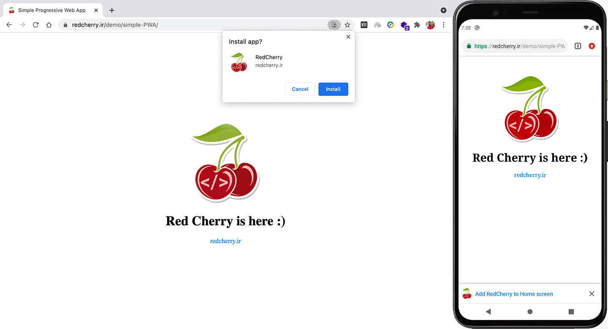

  <h1 align="left">Simple Progressive Web App (PWA)</h1>

This is a simple page for a Progressive Web App (PWA)

  

---

## About

Displays a simple PWA demo. Implemented here using the program manifest, service workers, and storage. In this version, it is possible to define the first page, the default offline page, and the pages that should not be cached.

## Demo

[https://alirahimi818.github.io/simple-PWA/](https://alirahimi818.github.io/simple-PWA/)

## َUsage

You can see how to use this package on the Red Cherry site in Persian
[https://redcherry.ir/?p=603](https://redcherry.ir/%d8%a2%d9%85%d9%88%d8%b2%d8%b4-%d9%be%db%8c%d8%a7%d8%af%d9%87-%d8%b3%d8%a7%d8%b2%db%8c-%d9%88%d8%a8-%d8%a7%d9%be%d9%84%db%8c%da%a9%db%8c%d8%b4%d9%86-%d9%be%db%8c%d8%b4-%d8%b1%d9%88%d9%86%d8%af%d9%87-p/)

